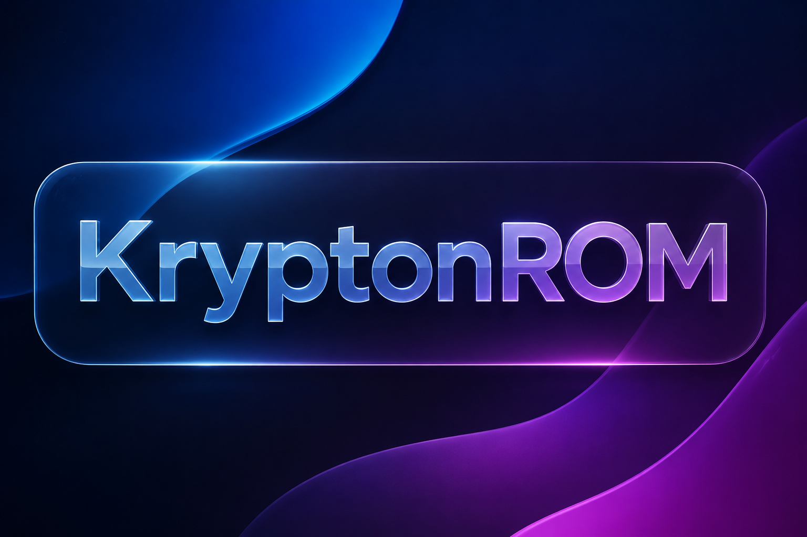

  

# ⚡ KryptonROM

> « A customized, smooth, and feature-packed Samsung One UI experience tailored for Samsung Galaxy devices. »

---

## 📌 Overview

**KryptonROM** brings modern One UI ports, custom flagship features, system optimizations, and enhanced performance to target devices while maintaining rock-solid stability for daily use.

---

## 📱 Supported Device: Galaxy A52s 5G (SM-A528B)

Select a **One UI Version** below to reveal available target bases and download links:

<b>🔹 One UI 4</b>

 

* **Galaxy A73 Base:** [Soon...](#)
* **Galaxy A52s Base:** [Soon...](#)

<b>🔹 One UI 5</b>

 

* **Galaxy A52s Base:** [Soon...](#)

<b>🔹 One UI 6</b>

 

* **Galaxy S21 FE Base:** [Soon...](#)
* **Galaxy S23 FE Base:** [Soon...](#)
* **Galaxy A73 Base:** [Soon...](#)
* **Galaxy S23 Ultra Base:** [Soon...](#)

<b>🔹 One UI 7</b>

 

* **Galaxy S21 FE Base:** [Soon...](#)
* **Galaxy S23 FE Base:** [Soon...](#)
* **Galaxy A73 Base:** [Soon...](#)
* **Galaxy S23 Ultra Base:** [Soon...](#)

<b>🔹 One UI 8</b>

 

* **Galaxy A73 Base:** [Soon...](#)
* **Galaxy S26 FE Base:** [Soon...](#)
* **Galaxy S26 Ultra Base:** [Soon...](#)

<b>🔹 One UI 8.5</b>

 

* **Galaxy S26 FE Base:** [Soon...](#)
* **Galaxy S26 Ultra Base:** [Soon...](#)

---

## ✨ Features Highlight

* 🚀 **Deep System Optimization:** Heavy debloat and improved background process handling.
* 🔓 **Flagship Ported Features:** Screen recorder, extra brightness support, and object/shadow remover.
* 🛡️ **Knox & Security Patches:** Secure Folder support, patched SELinux, and disabled security lockouts.
* 🎧 **Bluetooth Library Patcher:** Integrated fix for Bluetooth pairing persistence across reboots.

---

  <b>⚡ KryptonROM Project</b> 
  <i>Empowering your device with cross-generation One UI builds.</i>

